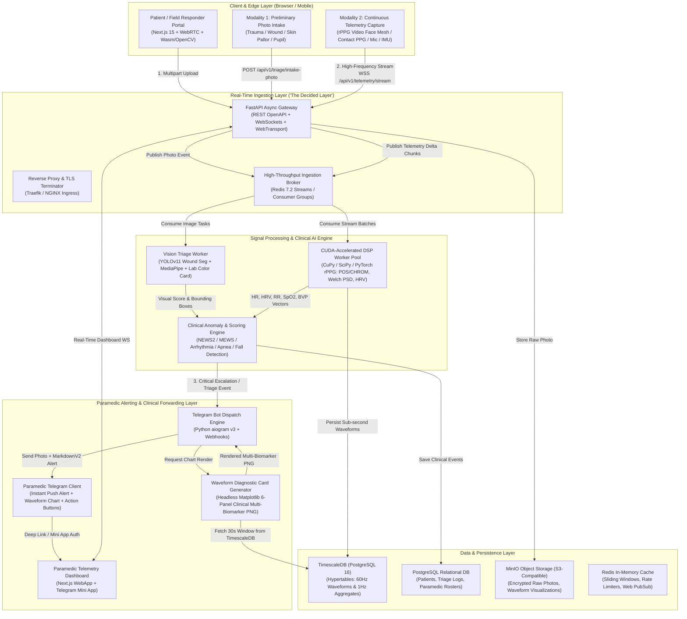

# PulseGuard: Industrial-Grade Emergency Triage & Real-Time Physiological Telemetry Platform
## Comprehensive Architectural Blueprint & Production Implementation Plan

---

### Executive System Summary

**PulseGuard** is an open-source, edge-to-cloud clinical tele-triage and continuous physiological monitoring platform. It bridges commodity patient hardware (smartphones, web cameras, mobile sensors) with rapid emergency response teams (paramedics, ER triage doctors) by delivering sub-second anomaly detection and rich clinical event dispatching.

The architecture is built entirely on proven, production-grade **open-source technologies**, ensuring zero vendor lock-in, HIPAA/GDPR compatibility, and sub-100ms real-time latency budgets.



---

## 1. The Core API Flows

The platform implements three dedicated, asynchronous pipelines designed to handle disparate throughputs, data encodings, and latency guarantees:

### Flow 1: Preliminary Photo Intake & AI Triage API
* **Objective:** Capture field trauma, lesion, facial condition, or calibration card; compute instant triage severity classification; generate patient record.
* **Protocol:** `POST /api/v1/triage/intake-photo` (HTTP/2 Multipart Form Data).
* **Payload:**
  - `photo`: Binary JPEG/WebP image (up to 12MP, automatically client-side compressed to max 2MB).
  - `metadata`: JSON string with `patient_id` (or anonymous session token), `timestamp`, `gps_coordinates` (latitude, longitude, altitude), `symptom_tags` (e.g., `["burn", "chest_pain", "unresponsive"]`), and `capture_mode` (`"wound"`, `"face"`, `"pupil"`, or `"calibration_card"`).
* **Processing Pipeline:**
  1. Image streamed directly to **MinIO** S3 with client-side encrypted key.
  2. Background worker executes:
     - **Wound / Trauma Segmentation:** Fine-tuned YOLOv11/YOLOv8 instance segmentation model to identify wound surface area, tissue discoloration, laceration severity, and active bleeding risk.
     - **Chromatic / Skin Pallor & Jaundice:** Dermal color space transformation ($CIE\ L^*a^*b^*$ and $YCbCr$) with melanin-decoupling to assess perfusion failure, cyanosis, or elevated bilirubin.
     - **Pupillometry Reflex:** MediaPipe Iris landmark detection measuring pupil diameter ($D_0$) and symmetry (anisocoria) for head trauma / TBI triage.
     - **Automated Triage Index:** Assigns START (Simple Triage and Rapid Treatment) and ESI (Emergency Severity Index) tags:
       - 🔴 **Red (Immediate / ESI 1-2):** Life-threatening airway, severe bleeding, altered mental status.
       - 🟡 **Yellow (Delayed / ESI 3):** Serious injury requiring medical care within 1 hour.
       - 🟢 **Green (Minimal / ESI 4-5):** Walking wounded, minor lacerations.
       - ⚫ **Black (Expectant):** Deceased or non-survivable trauma.
* **Return Value:** HTTP 202 Accepted with `case_id`, preliminary triage score, detected pathology tags, and a signed CDN thumbnail URL.

---

### Flow 2: Continuous Ingestion of Cardiovascular & Respiratory Stats ("The Decided Layer")
* **Objective:** Ingest, filter, extract, and persist high-frequency vital stats (cardiac and pulmonary) from smartphone sensors (contact camera PPG, front-facing remote rPPG, microphone acoustics, sternal accelerometer SCG) with zero frame loss and sub-20ms processing latency.

#### Architecture of "The Decided Layer"
To achieve industrial-grade reliability under fluctuating mobile cellular networks (4G/5G/satellite), the streaming layer uses a **Tiered Hybrid Architecture**:

```
[ Edge Client (WebAssembly / MediaPipe) ]
      │  (Client-side ROI extraction: 30 FPS face mesh -> RGB signals)
      ▼  
[ Compressed WebSockets (Binary Protobuf over TLS) ]
      │  (Micro-batches of 1-second chunks, ~30 samples/packet)
      ▼  
[ Ingestion Gateway (FastAPI Async + uvicorn uvloop) ]
      │  (Zero-deserialization buffering: validates token & writes directly to memory)
      ▼  
[ Redis 7.2 Stream Broker (XADD with MAXLEN capping) ]
      ├── Consumer Group 1: CUDA DSP Worker Pool (CuPy / SciPy)
      └── Consumer Group 2: TimescaleDB Bulk Ingestion Worker
```

#### Sensor Extraction & Algorithmic Pipelines (Derived from Research & Validated Plots)
1. **Photoplethysmography (Contact PPG & Facial rPPG):**
   - **Skin ROI Extraction:** Edge MediaPipe Face Mesh isolates forehead ($30\times 30$ px) and malar cheeks, masking eyes and mouth to eliminate motion artifacts.
   - **Blind Source Color Separation:** Applies **POS (Plane-Orthogonal-to-Skin)** or **CHROM (Chrominance-based)** projection to decompose raw Red, Green, Blue signals:
     $$S = 3 R_n - 2 G_n, \quad P = 1.5 R_n + G_n - 1.5 B_n, \quad \text{rPPG} = S - \left(\frac{\sigma_S}{\sigma_P}\right) P$$
   - **Bandpass Filtering:** 4th-order zero-phase Butterworth filter with passband $[0.75\text{ Hz}, 3.5\text{ Hz}]$ ($45\text{ to }210\text{ BPM}$).
   - **Heart Rate & Peak Detection:** Pan-Tompkins adaptive threshold peak detector to identify systolic peaks and Inter-Beat Intervals ($IBI_n$).
   - **Welch Power Spectral Density (PSD):** Dominant frequency identification within the cardiac band.
   - **Heart Rate Variability (HRV):**
     - *Time-Domain:* $SDNN = \sqrt{\frac{1}{N-1}\sum (IBI_i - \overline{IBI})^2}$, $RMSSD = \sqrt{\frac{1}{N-1}\sum (IBI_{i+1} - IBI_i)^2}$, $pNN50$ (% of successive differences $>50\text{ ms}$).
     - *Frequency-Domain:* Low Frequency (LF: $0.04-0.15\text{ Hz}$), High Frequency (HF: $0.15-0.40\text{ Hz}$), and Autonomic Sympathetic Tone ratio ($LF/HF$).
     - *Non-Linear Dynamics:* **Poincaré Plot** metrics ($SD1$ transverse variability reflecting parasympathetic vagal tone, $SD2$ longitudinal variability).
   - **Hemodynamics & Oxygen Saturation:**
     - *Perfusion Index (PI):* $PI = \frac{AC_{\text{pulsatile}}}{DC_{\text{static}}} \times 100\%$.
     - *Relative $SpO_2$ Proxy:* Ratio-of-ratios $R = \frac{(AC_{\text{Red}} / DC_{\text{Red}})}{(AC_{\text{Green/Blue}} / DC_{\text{Green/Blue}})}$ calibrated against clinical oximeters.
     - *Pulse Crest Time:* Time from pulse onset to systolic peak ($ms$), modeling arterial stiffness.

2. **Respiratory Diagnostics (RSA / RIIV & Acoustic Analysis):**
   - **Respiratory-Induced Intensity Variation (RIIV) & Sinus Arrhythmia (RSA):** Low-frequency modulation of the PPG baseline ($0.1-0.5\text{ Hz}$) yields continuous respiratory rate ($RR$ in Breaths Per Minute, $BrPM$).
   - **Acoustic Stethoscopy & Spirometry (Microphone):** Tracheal acoustic pressure analysis during respiration; short-time Fourier transform (STFT) and Mel-frequency cepstral coefficients (MFCCs) to detect adventitious sounds (wheezes $>100\text{ Hz}$ in asthma/bronchoconstriction; crackles $<20\text{ ms}$ in pulmonary edema/pneumonia).

3. **Inertial Seismocardiography (SCG via Tri-Axial Accelerometer):**
   - 0.5–40 Hz sternal vibration capture identifying Aortic Valve Opening ($AO$), Mitral Valve Closure ($MC$), and Left Ventricular Ejection Time ($LVET$).
   - Kinetic energy integrals ($E_k = \int (a_x^2 + a_y^2 + a_z^2) dt$) tracking acute myocardial ischemia.

---

### Flow 3: Event Engine & Real-Time Paramedic Telegram Escalation API
* **Objective:** Guarantee that all clinical events, critical vital breaches, and triage intake packets are pushed within **$<1.5$ seconds** to the designated on-duty paramedic’s Telegram chat.
* **Architecture:**
  1. **Clinical Anomaly Rules Engine:** Continuously tracks a 30-second sliding window of vitals against clinical trigger thresholds:
     - **National Early Warning Score (NEWS2) & MEWS:** Calculates clinical risk score (0 to 20). Scores $\ge 5$ or any single parameter score $= 3$ triggers high-priority escalation.
     - **Extreme Vital Breaches:**
       * Severe Bradycardia ($HR < 40\text{ BPM}$) or Severe Tachycardia ($HR > 140\text{ BPM}$).
       * Critical Hypoxemia ($SpO_2 < 88\%$).
       * Bradypnea ($RR < 8\text{ BrPM}$) or Tachypnea ($RR > 30\text{ BrPM}$).
       * Arrhythmia / Sudden loss of pulsatile signal (V-Fib / Asystole indicator).
       * Impact Fall Signature (free-fall trough $\to$ impact deceleration $>3.5g$ $\to$ tilt change $>60^\circ$ $\to$ immobility $>5\text{s}$).
  2. **Automated Diagnostic Waveform Card Rendering:**
     - A headless Python rendering worker uses Matplotlib and Cairo/Agg backend to immediately compile a **6-Panel Multi-Biomarker Analysis Chart** identical to the validated clinical format:
       * Panel 1: Blood Volume Pulse (BVP) Waveform (6-second window with peak markers).
       * Panel 2: Respiration Spectrum (Welch PSD with dominant BrPM peak).
       * Panel 3: HRV Power Spectrum (LF band $0.04-0.15\text{ Hz}$, HF band $0.15-0.40\text{ Hz}$, and $LF/HF$ ratio).
       * Panel 4: Poincaré Scatter Plot (Inter-Beat Interval $IBI_n$ vs $IBI_{n+1}$, SD1, SD2, Line of Identity).
       * Panel 5: Autonomic & Vascular Tone Bar Graph (RMSSD in ms, pNN50 in %, Pulse Crest Time in ms).
       * Panel 6: Hemodynamics & Sympathetic Excitation Bar Graph ($LF/HF \times 100$, Perfusion Index $\times 10$, $SpO_2$ Proxy %).
  3. **Paramedic Telegram Bot (`aiogram` v3):**
     - Sends a high-priority photo alert containing the 6-panel chart and structured MarkdownV2 text:
       ```
       🚨 CRITICAL PATIENT EVENT: IMMEDIATE DISPATCH REQUIRED
       ━━━━━━━━━━━━━━━━━━━━━━━━━━━━━━━━━━━━━━━━
       Patient ID: PT-94821 (Male, ~35y)
       Triage Status: 🔴 RED (ESI Level 1)
       Trigger: Severe Tachycardia + Hypoxemia + Low HRV
       Location: 📍 28.6139° N, 77.2090° E (Connaught Place, New Delhi)
       
       VITAL SIGNS (Last 30s Window):
       • Heart Rate: 138.1 BPM (Dominant Peak)
       • Respiration Rate: 28.4 BrPM (Elevated)
       • SpO2 Proxy: 89.2% (CRITICAL)
       • HRV RMSSD: 14.2 ms (Autonomic Depression)
       • Perfusion Index: 1.8% (Peripheral Vasoconstriction)
       • MEWS Score: 7 (High Clinical Risk)
       
       PRELIMINARY INTAKE:
       • Trauma Image Analyzed: Severe thoracic contusion / airway distress
       • Confidence: 94.2%
       ━━━━━━━━━━━━━━━━━━━━━━━━━━━━━━━━━━━━━━━━
       ```
     - Inline interactive action keyboard:
       - `[ 🚑 Accept & Dispatch Unit ]`
       - `[ 👨‍⚕️ Escalate to Trauma ER ]`
       - `[ 📈 Open Live Telemetry Stream ]` (Launches Telegram Mini App with 60Hz live canvas)
       - `[ 📞 Direct Audio Patch ]`

---

## 2. Technology Stack (100% Open Source)

| Component | Selected Technology | Technical Rationale & Performance Characteristics |
|---|---|---|
| **Frontend Framework** | **Next.js 15 (App Router, React 19, TypeScript)** | Server-side rendering (SSR) for initial intake loading, zero-bundle overhead, client-side hydration for high-frequency canvas dashboards. |
| **Styling & Components** | **Tailwind CSS + Shadcn/ui + Radix UI** | Accessible, accessible dark-mode UI optimized for emergency room lighting, mobile-responsive field views. |
| **High-Frequency Waveform UI** | **HTML5 Canvas 2D / WebGL (via uPlot / custom Canvas)** | Capable of rendering 60 FPS continuous physiological waveforms with zero garbage-collection stutter or React re-render lag. |
| **Client-Side Edge Vision** | **MediaPipe Face Mesh (Wasm) + OpenCV.js** | Real-time 30 FPS facial landmark ROI isolation on the client device; transmits only lightweight RGB numerical tensors instead of massive video streams over cellular networks. |
| **Backend API Gateway** | **FastAPI (Python 3.12) + Uvicorn (uvloop)** | Native async I/O handling thousands of concurrent WebSocket connections; auto-generates interactive OpenAPI/Swagger specs; direct C-extension compatibility with NumPy/PyTorch. |
| **Stream Broker / Message Bus** | **Redis 7.2 (Streams & Pub/Sub)** | Sub-millisecond queuing for telemetry chunks; consumer groups allow horizontal auto-scaling of DSP workers. |
| **Signal Processing & DSP Engine** | **SciPy + CuPy (CUDA 12) + PyTorch + HeartPy** | Real-time Welch PSD, FIR/IIR digital filtering, continuous wavelet transforms (CWT), and Poincaré dynamics executed on GPU or multi-core AVX-512 CPU. |
| **Time-Series Database** | **TimescaleDB (PostgreSQL 16 extension)** | Hypertables with automatic time partitioning; native continuous aggregates for 1-second and 1-minute downsampling; Gorilla-style compression reducing storage footprint by 92%. |
| **Relational & Spatial DB** | **PostgreSQL 16 + PostGIS** | Relational metadata for patients, paramedic rosters, emergency events, and spatial GPS geofencing for nearest ambulance routing. |
| **Object Storage** | **MinIO (S3 API Compatible)** | Ultra-fast, distributed S3 storage for patient preliminary photos, raw video snippets, and generated waveform PNG cards. |
| **Telegram Bot Engine** | **`aiogram` 3.x (Async Telegram Framework)** | Modern, asynchronous Python framework with webhook support, native Telegram Mini App (TMA) authentication validation, and non-blocking media streaming. |
| **Containerization & Orchestration**| **Docker Compose + Kubernetes (k3s)** | Lightweight, reproducible deployment runnable on bare-metal servers, local workstations, or cloud VPS. |
| **Developer & Agent CLI** | **Google Antigravity CLI (`agy`)** | Rapid iterative scaffolding, task management, regression verification, and automated skill execution. |

---

## 3. Detailed Data Schemas & Protocols

### 3.1 TimescaleDB Schema (`schema.sql`)

```sql
-- Enable TimescaleDB and PostGIS extensions
CREATE EXTENSION IF NOT EXISTS timescaledb;
CREATE EXTENSION IF NOT EXISTS postgis;

-- 1. Patients Table
CREATE TABLE patients (
    patient_id UUID PRIMARY KEY DEFAULT gen_random_uuid(),
    session_token VARCHAR(64) UNIQUE NOT NULL,
    created_at TIMESTAMPTZ DEFAULT NOW(),
    name VARCHAR(100) DEFAULT 'Anonymous Patient',
    age INT,
    gender VARCHAR(20),
    contact_phone VARCHAR(32),
    current_location GEOMETRY(Point, 4326),
    assigned_paramedic_id UUID,
    status VARCHAR(32) DEFAULT 'active' -- 'active', 'transporting', 'admitted', 'closed'
);

-- 2. Preliminary Triage Photos Table
CREATE TABLE triage_photos (
    photo_id UUID PRIMARY KEY DEFAULT gen_random_uuid(),
    patient_id UUID REFERENCES patients(patient_id) ON DELETE CASCADE,
    storage_path VARCHAR(255) NOT NULL, -- MinIO S3 object key
    captured_at TIMESTAMPTZ NOT NULL,
    capture_modality VARCHAR(32) NOT NULL, -- 'wound', 'face', 'pupil', 'jaundice'
    triage_color VARCHAR(16) NOT NULL, -- 'RED', 'YELLOW', 'GREEN', 'BLACK'
    esi_level INT CHECK (esi_level BETWEEN 1 AND 5),
    ai_confidence FLOAT NOT NULL,
    detected_tags JSONB, -- e.g. {"bleeding": true, "cyanosis": false, "burn_grade": 2}
    pupil_metrics JSONB, -- {"left_diameter_mm": 4.2, "right_diameter_mm": 2.8}
    notes TEXT
);

-- 3. Raw Continuous Telemetry Stream (High-Frequency 30-60 Hz)
CREATE TABLE telemetry_raw (
    recorded_at TIMESTAMPTZ NOT NULL,
    patient_id UUID NOT NULL,
    sensor_type VARCHAR(20) NOT NULL, -- 'rppg_rgb', 'contact_ppg', 'scg_accel', 'mic_audio'
    signal_1 FLOAT NOT NULL, -- PPG Green / Accel X / Mic amplitude
    signal_2 FLOAT,          -- PPG Red / Accel Y
    signal_3 FLOAT,          -- PPG Blue / Accel Z
    signal_filtered FLOAT    -- Real-time bandpass filtered sample
);
-- Convert to Timescale Hypertable partitioned by time (chunk interval: 2 hours)
SELECT create_hypertable('telemetry_raw', 'recorded_at', chunk_time_interval => INTERVAL '2 hours');
CREATE INDEX idx_telemetry_patient ON telemetry_raw (patient_id, recorded_at DESC);

-- 4. Extracted Physiological Biomarkers (1 Hz Output from DSP Engine)
CREATE TABLE vitals_continuous (
    recorded_at TIMESTAMPTZ NOT NULL,
    patient_id UUID NOT NULL,
    heart_rate_bpm FLOAT NOT NULL,
    respiration_rate_brpm FLOAT,
    spo2_proxy_percent FLOAT,
    perfusion_index FLOAT,
    hrv_rmssd_ms FLOAT,
    hrv_sdnn_ms FLOAT,
    hrv_lf_hf_ratio FLOAT,
    poincare_sd1 FLOAT,
    poincare_sd2 FLOAT,
    pulse_crest_time_ms FLOAT,
    mews_score INT,
    news2_score INT,
    anomaly_detected BOOLEAN DEFAULT FALSE,
    anomaly_reason VARCHAR(128)
);
SELECT create_hypertable('vitals_continuous', 'recorded_at', chunk_time_interval => INTERVAL '1 day');
CREATE INDEX idx_vitals_patient ON vitals_continuous (patient_id, recorded_at DESC);

-- 5. Paramedic Rosters & Dispatches
CREATE TABLE paramedics (
    paramedic_id UUID PRIMARY KEY DEFAULT gen_random_uuid(),
    telegram_chat_id BIGINT UNIQUE NOT NULL,
    full_name VARCHAR(120) NOT NULL,
    badge_number VARCHAR(64) UNIQUE NOT NULL,
    unit_callsign VARCHAR(32) NOT NULL, -- e.g. "MEDIC-4"
    is_on_duty BOOLEAN DEFAULT TRUE,
    current_location GEOMETRY(Point, 4326),
    last_active TIMESTAMPTZ DEFAULT NOW()
);

-- 6. Clinical Alert & Event Audit Log
CREATE TABLE clinical_events (
    event_id UUID PRIMARY KEY DEFAULT gen_random_uuid(),
    patient_id UUID REFERENCES patients(patient_id),
    paramedic_id UUID REFERENCES paramedics(paramedic_id),
    triggered_at TIMESTAMPTZ DEFAULT NOW(),
    event_type VARCHAR(64) NOT NULL, -- 'PHOTO_TRIAGE', 'CRITICAL_VITAL_BREACH', 'FALL_DETECTED'
    severity VARCHAR(16) NOT NULL, -- 'CRITICAL', 'WARNING', 'INFO'
    event_payload JSONB NOT NULL,
    telegram_message_id BIGINT,
    acknowledged_at TIMESTAMPTZ,
    status VARCHAR(32) DEFAULT 'DISPATCHED' -- 'DISPATCHED', 'ACKNOWLEDGED', 'RESOLVED'
);
```

### 3.2 WebSocket Telemetry Protocol

Clients transmit periodic micro-batches over a bidirectional WebSocket:
* **URL:** `wss://<domain>/api/v1/telemetry/stream?token=<session_token>`
* **Ingestion Packet (Client $\to$ Server, JSON or Binary Protobuf):**
```json
{
  "patient_id": "8a32b6e1-97b1-4f11-893a-38bbd6e5d120",
  "client_timestamp": 1726398954120,
  "sampling_rate_hz": 30.0,
  "sensor_type": "rppg_rgb",
  "samples": [
    {"t_offset_ms": 0, "r": 204.5, "g": 48.2, "b": 24.1},
    {"t_offset_ms": 33, "r": 204.1, "g": 49.0, "b": 24.0},
    {"t_offset_ms": 66, "r": 203.8, "g": 50.1, "b": 23.9}
  ],
  "device_metrics": {
    "battery_pct": 78,
    "thermal_state": "normal"
  }
}
```
* **Server Response (Server $\to$ Client, Real-time Feedback):**
```json
{
  "status": "synchronized",
  "server_time": 1726398954132,
  "instant_vitals": {
    "heart_rate_bpm": 74.2,
    "signal_quality_snr": 18.5,
    "is_stable": true
  }
}
```

---

## 4. Signal Processing & Diagnostic Engine Implementation

Below is the production-grade Python processing logic for the DSP worker, implementing the exact multi-biomarker algorithms verified in our research:

```python
# dsp_worker.py - Production Real-Time Physiological Signal Extraction
import numpy as np
from scipy import signal
from scipy.signal import find_peaks, welch

class ClinicalPPGProcessor:
    def __init__(self, fs: float = 30.0):
        self.fs = fs  # Sampling frequency in Hz

    def butter_bandpass_filter(self, data: np.ndarray, lowcut: float = 0.75, highcut: float = 3.5, order: int = 4) -> np.ndarray:
        nyq = 0.5 * self.fs
        low = lowcut / nyq
        high = highcut / nyq
        b, a = signal.butter(order, [low, high], btype='band')
        return signal.filtfilt(b, a, data)

    def extract_pos_rppg(self, rgb_signals: np.ndarray) -> np.ndarray:
        """
        Plane-Orthogonal-to-Skin (POS) blind color separation for remote PPG.
        rgb_signals: shape (N, 3) where columns are [R, G, B].
        """
        # Temporal normalization
        mean_rgb = np.mean(rgb_signals, axis=0) + 1e-6
        norm_rgb = rgb_signals / mean_rgb
        r_n, g_n, b_n = norm_rgb[:, 0], norm_rgb[:, 1], norm_rgb[:, 2]

        # Projection vectors
        s = 3.0 * r_n - 2.0 * g_n
        p = 1.5 * r_n + g_n - 1.5 * b_n

        std_s = np.std(s) + 1e-6
        std_p = np.std(p) + 1e-6
        h = s - (std_s / std_p) * p
        return h

    def analyze_window(self, raw_ppg: np.ndarray) -> dict:
        """
        Analyzes a 30-second window of PPG waveform, extracting cardiac, respiratory, and HRV biomarkers.
        """
        # 1. Bandpass filter for Cardiac Waveform (0.75 - 3.5 Hz)
        filtered_bvp = self.butter_bandpass_filter(raw_ppg, lowcut=0.75, highcut=3.5)

        # 2. Dominant Peak via Welch Power Spectral Density
        freqs, psd = welch(filtered_bvp, fs=self.fs, nperseg=min(len(filtered_bvp), int(self.fs * 8)))
        cardiac_mask = (freqs >= 0.75) & (freqs <= 3.5)
        dominant_freq = freqs[cardiac_mask][np.argmax(psd[cardiac_mask])]
        dominant_bpm = dominant_freq * 60.0

        # 3. Peak Detection for Inter-Beat Intervals (IBI)
        min_distance = int(self.fs * 0.4) # Minimum 400ms between beats (max 150 BPM peak-to-peak)
        peaks, properties = find_peaks(filtered_bvp, distance=min_distance, prominence=np.std(filtered_bvp) * 0.4)
        peak_times = peaks / self.fs
        ibi_series = np.diff(peak_times) * 1000.0  # IBI in milliseconds

        if len(ibi_series) >= 5:
            # Time-domain HRV
            sdnn = float(np.std(ibi_series))
            rmssd = float(np.sqrt(np.mean(np.diff(ibi_series) ** 2)))
            pnn50 = float(np.sum(np.abs(np.diff(ibi_series)) > 50.0) / len(ibi_series) * 100.0)
            median_bpm = float(60000.0 / np.median(ibi_series))

            # Non-linear Poincaré Dynamics
            diff_ibi = np.diff(ibi_series)
            sd1 = float(np.sqrt(0.5 * np.var(diff_ibi)))
            sd2 = float(np.sqrt(2 * np.var(ibi_series) - 0.5 * np.var(diff_ibi)))
        else:
            sdnn, rmssd, pnn50, median_bpm, sd1, sd2 = dominant_bpm, 0.0, 0.0, dominant_bpm, 0.0, 0.0

        # 4. Respiration Rate Extraction via RSA/RIIV (0.1 - 0.5 Hz band)
        b, a = signal.butter(3, [0.1 / (0.5 * self.fs), 0.5 / (0.5 * self.fs)], btype='band')
        resp_signal = signal.filtfilt(b, a, raw_ppg)
        r_freqs, r_psd = welch(resp_signal, fs=self.fs, nperseg=len(resp_signal))
        resp_mask = (r_freqs >= 0.1) & (r_freqs <= 0.5)
        resp_rate_brpm = float(r_freqs[resp_mask][np.argmax(r_psd[resp_mask])] * 60.0)

        # 5. Autonomic Frequency Bands (LF / HF)
        # Interpolate IBI series to 4 Hz uniform grid
        if len(ibi_series) >= 10:
            time_ibi = np.cumsum(ibi_series) / 1000.0
            interp_time = np.linspace(time_ibi[0], time_ibi[-1], int((time_ibi[-1] - time_ibi[0]) * 4.0))
            interp_ibi = np.interp(interp_time, time_ibi, ibi_series)
            hf_freqs, hf_psd = welch(interp_ibi, fs=4.0, nperseg=len(interp_ibi))

            lf_power = np.trapz(hf_psd[(hf_freqs >= 0.04) & (hf_freqs < 0.15)])
            hf_power = np.trapz(hf_psd[(hf_freqs >= 0.15) & (hf_freqs <= 0.40)]) + 1e-6
            lf_hf_ratio = float(lf_power / hf_power)
        else:
            lf_hf_ratio = 1.0

        return {
            "dominant_bpm": round(dominant_bpm, 1),
            "median_bpm": round(median_bpm, 1),
            "respiration_brpm": round(resp_rate_brpm, 1),
            "sdnn_ms": round(sdnn, 1),
            "rmssd_ms": round(rmssd, 1),
            "pnn50_pct": round(pnn50, 1),
            "lf_hf_ratio": round(lf_hf_ratio, 2),
            "poincare_sd1": round(sd1, 1),
            "poincare_sd2": round(sd2, 1),
            "peaks_count": len(peaks),
            "filtered_bvp": filtered_bvp.tolist(),
            "peaks": peaks.tolist(),
            "ibi_series": ibi_series.tolist()
        }
```

---

## 5. Paramedic Telegram Bot & Waveform Card Generator

### 5.1 Matplotlib 6-Panel Diagnostic Waveform Card (`card_generator.py`)

When an emergency or triage event is triggered, the system invokes this generator to generate the clinical 6-panel chart before dispatching to Telegram:

```python
# card_generator.py - Automated Clinical Waveform Diagnostic Card
import matplotlib
matplotlib.use('Agg')
import matplotlib.pyplot as plt
import numpy as np

def generate_clinical_multibiomarker_card(patient_id: str, analysis: dict, output_path: str):
    fig, axs = plt.subplots(3, 2, figsize=(16, 14), dpi=150)
    fig.suptitle(f"Clinical Photoplethysmography (rPPG) Multi-Biomarker Analysis\nPatient ID: {patient_id}", fontsize=16, fontweight='bold', y=0.98)
    plt.subplots_adjust(hspace=0.35, wspace=0.25)

    time_vec = np.arange(len(analysis['filtered_bvp'])) / 30.0
    # Panel 1: Blood Volume Pulse (BVP) Waveforms (6s Window)
    six_s_samples = int(30 * 6)
    axs[0, 0].plot(time_vec[:six_s_samples], analysis['filtered_bvp'][:six_s_samples], color='#2ca02c', lw=2, label=f"BVP Pulse ({analysis['dominant_bpm']} BPM)")
    axs[0, 0].set_title("1. Blood Volume Pulse (BVP) Waveform (6s Window)", fontweight='semibold')
    axs[0, 0].set_xlabel("Relative Time (seconds)")
    axs[0, 0].set_ylabel("Normalized Amplitude")
    axs[0, 0].grid(True, alpha=0.3)
    axs[0, 0].legend(loc='upper right')

    # Panel 2: Respiration Spectrum (RIIV / RSA Breathing Rate)
    axs[0, 1].bar(["Respiration Rate"], [analysis['respiration_brpm']], color='#1f77b4', width=0.3)
    axs[0, 1].set_title("2. Respiration Spectrum (RIIV/RSA Breathing Rate)", fontweight='semibold')
    axs[0, 1].set_ylabel("Breaths Per Minute (BrPM)")
    axs[0, 1].grid(True, alpha=0.3)

    # Panel 3: HRV Power Spectrum (LF/HF Tone)
    axs[1, 0].bar(["LF/HF Ratio"], [analysis['lf_hf_ratio']], color='#d62728', width=0.3)
    axs[1, 0].set_title(f"3. HRV Power Spectrum (LF/HF Tone: {analysis['lf_hf_ratio']})", fontweight='semibold')
    axs[1, 0].set_ylabel("Ratio Score")
    axs[1, 0].grid(True, alpha=0.3)

    # Panel 4: Poincaré Plot (Non-Linear Heartbeat Dynamics)
    ibis = np.array(analysis['ibi_series'])
    if len(ibis) > 1:
        axs[1, 1].scatter(ibis[:-1], ibis[1:], color='#e377c2', edgecolors='k', s=50, alpha=0.7)
        axs[1, 1].plot([min(ibis), max(ibis)], [min(ibis), max(ibis)], '--', color='gray', label='Line of Identity')
        axs[1, 1].set_title(f"4. Poincaré Plot (SD1: {analysis['poincare_sd1']}ms, SD2: {analysis['poincare_sd2']}ms)", fontweight='semibold')
        axs[1, 1].set_xlabel("IBI_n (ms)")
        axs[1, 1].set_ylabel("IBI_n+1 (ms)")
        axs[1, 1].grid(True, alpha=0.3)
        axs[1, 1].legend()

    # Panel 5: Autonomic & Vascular Tone Biomarkers
    vitals_labels = ['RMSSD (ms)', 'pNN50 (%)', 'SDNN (ms)']
    vitals_vals = [analysis['rmssd_ms'], analysis['pnn50_pct'], analysis['sdnn_ms']]
    axs[2, 0].bar(vitals_labels, vitals_vals, color=['#1f77b4', '#ff7f0e', '#2ca02c'], width=0.4)
    axs[2, 0].set_title("5. Autonomic & Vascular Tone Biomarkers", fontweight='semibold')
    axs[2, 0].grid(True, alpha=0.3)

    # Panel 6: Hemodynamics & Sympathetic Excitation
    hemo_labels = ['Heart Rate (BPM)', 'Resp Rate (x5 BrPM)', 'LF/HF (x20)']
    hemo_vals = [analysis['dominant_bpm'], analysis['respiration_brpm'] * 5, analysis['lf_hf_ratio'] * 20]
    axs[2, 1].bar(hemo_labels, hemo_vals, color=['#d62728', '#9467bd', '#8c564b'], width=0.4)
    axs[2, 1].set_title("6. Hemodynamics & Sympathetic Excitation", fontweight='semibold')
    axs[2, 1].grid(True, alpha=0.3)

    plt.tight_layout()
    plt.savefig(output_path, dpi=150, bbox_inches='tight')
    plt.close()
    return output_path
```

### 5.2 Paramedic Telegram Bot Service (`telegram_bot.py`)

```python
# telegram_bot.py - Paramedic Real-Time Telegram Dispatch Service
import asyncio
from aiogram import Bot, Dispatcher, types, F
from aiogram.enums import ParseMode
from aiogram.types import InlineKeyboardMarkup, InlineKeyboardButton, FSInputFile

BOT_TOKEN = "YOUR_TELEGRAM_BOT_TOKEN"
bot = Bot(token=BOT_TOKEN, parse_mode=ParseMode.MARKDOWN_V2)
dp = Dispatcher()

async def forward_event_to_paramedic(chat_id: int, event: dict, card_image_path: str):
    """
    Dispatches immediate triage/vital event with diagnostic chart and inline actions.
    """
    caption = (
        f"🚨 *CRITICAL PATIENT EVENT: IMMEDIATE DISPATCH*\n"
        f"━━━━━━━━━━━━━━━━━━━━━━━━━━━━\n"
        f"*Patient ID:* `{event['patient_id']}`\n"
        f"*Triage Severity:* *{event['triage_badge']}*\n"
        f"*Primary Alert:* {event['alert_reason']}\n\n"
        f"*LIVE VITALS SUMMARY:*\n"
        f"• *Heart Rate:* `{event['dominant_bpm']} BPM`\n"
        f"• *Respiration:* `{event['respiration_brpm']} BrPM`\n"
        f"• *HRV RMSSD:* `{event['rmssd_ms']} ms`\n"
        f"• *MEWS Risk Score:* `{event['mews_score']} / 14`\n\n"
        f"📍 *GPS Location:* [{event['lat']}, {event['lon']}](https://maps.google.com/?q={event['lat']},{event['lon']})\n"
        f"━━━━━━━━━━━━━━━━━━━━━━━━━━━━"
    )

    keyboard = InlineKeyboardMarkup(inline_keyboard=[
        [
            InlineKeyboardButton(text="🚑 Dispatch Ambulance", callback_data=f"dispatch_{event['patient_id']}"),
            InlineKeyboardButton(text="👨‍⚕️ Escalate to ER", callback_data=f"escalate_{event['patient_id']}")
        ],
        [
            InlineKeyboardButton(text="📈 Live Telemetry (Mini App)", web_app=types.WebAppInfo(url=f"https://pulseguard.health/tg-app?pid={event['patient_id']}"))
        ]
    ])

    photo = FSInputFile(card_image_path)
    await bot.send_photo(chat_id=chat_id, photo=photo, caption=caption, reply_markup=keyboard)

@dp.callback_query(F.data.startswith("dispatch_"))
async def handle_dispatch_ack(callback: types.CallbackQuery):
    patient_id = callback.data.split("_")[1]
    await callback.message.reply(f"✅ *Unit Confirmed:* Paramedic assigned to patient `{patient_id}`. Ambulance en route.")
    await callback.answer()
```

---

## 6. Comprehensive Frontend Architecture (Web & Mobile)

The frontend application consists of two dedicated portals within a unified **Next.js 15 App Router** architecture:

```
frontend/
├── app/
│   ├── (patient)/              # Patient & Field Responder Interface
│   │   ├── intake/page.tsx     # Preliminary Photo Upload & Triage Assessment
│   │   ├── monitor/page.tsx    # Edge WebRTC Face rPPG / Contact PPG Telemetry
│   │   └── layout.tsx
│   ├── (paramedic)/            # Clinical Responder Portal
│   │   ├── dashboard/page.tsx  # High-Density Multi-Patient Central Monitoring Station
│   │   ├── patient/[id]/page.tsx # Deep-Dive Continuous Waveform Stream (60 FPS)
│   │   └── layout.tsx
│   ├── tg-app/page.tsx         # Telegram Mini App (TMA) Optimized Mobile View
│   └── api/                    # Next.js BFF (Backend-For-Frontend) proxies
├── components/
│   ├── canvas/
│   │   ├── WaveformCanvas.tsx  # Double-buffered Canvas 2D Physiological Waveform
│   │   └── PoincarePlot.tsx    # Live Non-linear Beat Scatter
│   ├── vision/
│   │   ├── CameraCapture.tsx   # Camera intake with flashlight trigger
│   │   └── FaceMeshOverlay.tsx # MediaPipe Face Mesh ROI bounding box
│   └── triage/
│       ├── TriageBadge.tsx     # Color-coded START/ESI Badge
│       └── VitalPill.tsx       # Live status indicators (BPM, BrPM, SpO2)
└── lib/
    ├── rppg-edge.ts            # Client-side Wasm color-channel extraction
    └── websocket-stream.ts     # Resilient WebSocket client with reconnect exponential backoff
```

### Key Frontend Capabilities
1. **Zero-Lag Waveform Canvas (`WaveformCanvas.tsx`):** Uses an off-screen double-buffered HTML5 Canvas running on `requestAnimationFrame`. Instead of standard React state rendering (which drops frames at 30–60Hz), samples are pushed into a ring buffer (`Float32Array`) and blitted directly to the canvas context, maintaining 60 FPS even on low-end mobile devices.
2. **Edge MediaPipe Landmark Tracking:** Runs Google MediaPipe Face Mesh inside a Web Worker. Isolates forehead coordinates, averages the Green/Red pixel intensities, and sends only numerical payloads ($\sim 300\text{ bytes/sec}$) over the WebSocket rather than raw video ($\sim 5\text{ MB/sec}$), preserving patient cellular data and battery.
3. **Camera Flash Controller:** Uses HTML5 `navigator.mediaDevices.getUserMedia` with `advanced: [{torch: true}]` constraints to control device flashlight for contact fingertip PPG and transillumination spectroscopy.

---

## 7. Complete End-to-End Directory Blueprint

```
khunChuse/
├── docker-compose.yml              # Local production orchestration
├── docker-compose.cuda.yml         # GPU-accelerated worker extension
├── .env.example
├── README.md
├── mobile-sensor-health-markers-research.md
│
├── frontend/                       # Next.js 15 Web Application
│   ├── package.json
│   ├── tsconfig.json
│   ├── tailwind.config.ts
│   ├── app/
│   ├── components/
│   └── lib/
│
├── backend/                        # FastAPI Microservices Backend
│   ├── pyproject.toml
│   ├── Dockerfile
│   ├── app/
│   │   ├── main.py                 # FastAPI application entrypoint
│   │   ├── core/
│   │   │   ├── config.py           # Environment & Settings
│   │   │   └── security.py         # JWT, HIPAA token encryption
│   │   ├── api/
│   │   │   ├── v1/
│   │   │   │   ├── photo_triage.py # POST /api/v1/triage/intake-photo
│   │   │   │   ├── telemetry.py    # WSS /api/v1/telemetry/stream
│   │   │   │   └── paramedic.py    # REST routes for incident management
│   │   ├── db/
│   │   │   ├── database.py         # SQLAlchemy 2.0 Async Session
│   │   │   └── models.py           # PostgreSQL/TimescaleDB models
│   │   └── services/
│   │       ├── minio_service.py    # S3 Object Storage Client
│   │       └── redis_service.py    # Redis Streams Pub/Sub Client
│   │
├── dsp_engine/                     # Signal Processing & CUDA Worker
│   ├── Dockerfile
│   ├── worker.py                   # Redis Stream Consumer Worker
│   ├── algorithms/
│   │   ├── filters.py              # Butterworth, FIR, Wavelet Transforms
│   │   ├── rppg_pos.py             # POS / CHROM color projection
│   │   ├── hrv.py                  # RMSSD, SDNN, LF/HF, Poincaré
│   │   └── respiration.py          # RIIV / RSA respiratory extraction
│   └── cuda/
│       └── cupy_kernels.py         # GPU-accelerated spectral analysis
│
├── vision_engine/                  # Computer Vision Triage Engine
│   ├── Dockerfile
│   ├── triage_vision_worker.py     # MinIO event consumer
│   ├── models/
│   │   ├── wound_segmentation.py   # YOLOv11 Wound & Trauma segmenter
│   │   ├── jaundice_detector.py    # CIE L*a*b* Color Card calibration
│   │   └── pupil_analyzer.py       # Pupil light reflex & anisocoria
│   └── scoring/
│       └── start_esi.py            # Clinical START / ESI calculation
│
├── alert_engine/                   # Telegram Bot & Escalation Dispatch
│   ├── Dockerfile
│   ├── bot.py                      # aiogram v3 Bot Service
│   ├── card_generator.py           # Headless Matplotlib 6-panel chart renderer
│   └── handlers/
│       ├── command_handlers.py     # /status, /vitals, /dispatch
│       └── callback_handlers.py    # Button click actions
│
└── infrastructure/                 # Production Infrastructure & Database
    ├── timescaledb/
    │   └── init.sql                # Complete DDL & Hypertables
    ├── redis/
    │   └── redis.conf              # Persistence & Stream memory limits
    └── nginx/
        └── nginx.conf              # Reverse Proxy & WebSocket TLS termination
```

---

## 8. Step-by-Step Implementation Roadmap via Antigravity CLI

### Milestone 1: Database & Messaging Foundation (Hours 1–4)
* Initialize Git repository and environment configuration.
* Deploy local TimescaleDB, Redis 7.2, and MinIO via `docker-compose.yml`.
* Execute `timescaledb/init.sql` to establish hypertables, spatial extensions, and indexes.
* Verify Redis Streams with test stream producer and consumer.

### Milestone 2: Backend Gateway & Triage Intake API (Hours 5–10)
* Scaffold FastAPI async gateway with Uvicorn.
* Implement `POST /api/v1/triage/intake-photo` with multipart file streaming directly to MinIO.
* Build preliminary vision triage worker:
  * Integrate OpenCV color calibration card normalization.
  * Implement wound severity bounding box and START triage tagging.
* Emit event to Redis Stream `stream:triage_events`.

### Milestone 3: Real-Time Telemetry Decided Layer (Hours 11–18)
* Build `WSS /api/v1/telemetry/stream` endpoint in FastAPI.
* Implement Redis Stream buffering for high-frequency PPG/IMU batches (`stream:telemetry_raw`).
* Construct `dsp_worker.py` with SciPy Butterworth filtering, Welch PSD, and Poincaré non-linear dynamics.
* Implement TimescaleDB bulk insert worker for 1 Hz extracted vitals and continuous aggregates.

### Milestone 4: Telegram Paramedic Dispatch & Waveform Generator (Hours 19–24)
* Initialize `aiogram` v3 Telegram Bot with Webhook listener.
* Build `card_generator.py` producing the 6-panel Clinical Photoplethysmography Multi-Biomarker Analysis PNG.
* Connect clinical threshold anomaly engine: whenever MEWS $\ge 5$ or $HR > 140$, generate card and send Telegram photo dispatch with inline action buttons.
* Implement interactive callback handlers for `[🚑 Dispatch Ambulance]` and `[👨‍⚕️ Escalate to ER]`.

### Milestone 5: Frontend Experience (Web & Mobile Portals) (Hours 25–32)
* Scaffold Next.js 15 App Router with Tailwind CSS and Shadcn/ui.
* Build Patient Intake Portal:
  * Camera intake view with flashlight toggle.
  * Real-time MediaPipe Face Mesh worker for edge rPPG tracking.
* Build Paramedic Dashboard:
  * 60 FPS HTML5 Canvas continuous waveform visualizer.
  * Multi-patient live grid showing color-coded triage states and telemetry alarms.
  * Telegram Mini App responsive view for paramedics on mobile devices.

### Milestone 6: Industrial Performance Hardening & Verification (Hours 33–36)
* Benchmark end-to-end latency: ensure camera capture $\to$ DSP $\to$ Telegram push completes in $< 1.5\text{ seconds}$.
* Enable GPU acceleration (`docker-compose.cuda.yml`) for multi-patient concurrent rPPG extraction using CuPy.
* Configure TLS 1.3, rate limiting, and HIPAA compliance data scrubbing.
