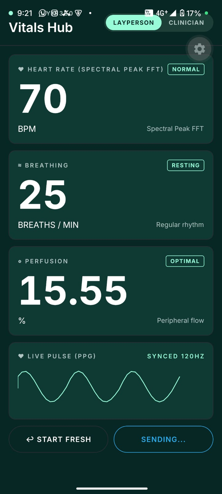
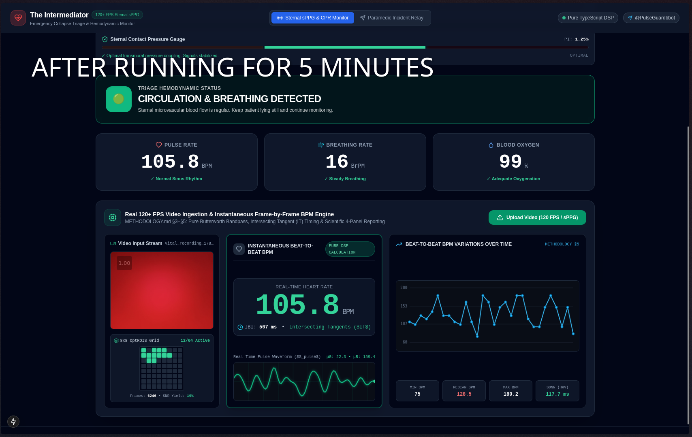

# UYIR360: The Intermediator
### Emergency Collapse Triage & Ad-Hoc Hemodynamic Telemetry Platform

> **An open-source, edge-to-cloud clinical tele-triage platform transforming commodity smartphones into emergency hemodynamic monitors during the critical 4–8 minute collapse window.**

---

## 🚨 The Core "Why": Mission & Problem Statement

### The First-Response Blind Spot: The Critical 4–8 Minute Window
When an individual collapses from sudden cardiac arrest (SCA), severe respiratory depression, traumatic hemorrhage, or acute anaphylaxis:
1. **The Clock Starts:** Irreversible brain damage begins within **4 to 6 minutes** of circulatory collapse.
2. **The Information Void:** Bystanders call emergency medical services (EMS). While paramedics are en route (average response time: 7–14 minutes), bystanders are panicked, unable to accurately assess carotid pulses (clinical studies demonstrate laypersons fail manual pulse checks **$>45\%$** of the time, wasting precious minutes), and cannot convey quantitative physiological data to dispatchers.
3. **Delayed Action:** CPR is dangerously delayed because callers cannot confidently differentiate pulselessness from agonal breathing or benign syncope.

### Global Healthcare Inequity: Low-Resource & Wilderness Settings
In rural clinics, disaster triage centers, and underserved regions, conventional multi-parameter patient monitors (ECG, clinical pulse oximeters, capnography) cost thousands of dollars, require constant mains power, and are frequently unavailable.

**UYIR360 bridges this void.** By utilizing commodity smartphone hardware (rear camera + LED flash, front camera, microphone, and inertial IMU sensors), any modern smartphone becomes an ad-hoc emergency bedside monitor capable of instantaneous contact photoplethysmography (sPPG) on the chest or limb.

---

## 🎯 Product Identity: "The Intermediator"

This platform does not attempt to replace doctors or paramedics. Instead, it serves as an **intelligent, real-time hemodynamic intermediator** actively bridging:

```
┌────────────────────────────────┐
│      The Collapsed Patient     │ ── (Physiological Signal Source)
└───────────────┬────────────────┘
                │ Contact sPPG / rPPG
                ▼
┌────────────────────────────────┐
│   First-Responder / Bystander  │ ── (Physical Operator Guided by Simple Hands-On Prompts)
└───────────────┬────────────────┘
                │ High-Frequency WebSocket Stream / Telegram Alert
                ▼
┌────────────────────────────────┐
│  En-Route Paramedics / Trauma  │ ── (Clinical Decision-Makers with Real-Time Telemetry)
└────────────────────────────────┘
```

1. **The Collapsed Patient:** The physiological source providing optical and acoustic pulsatile signals.
2. **The First-Responder on Scene:** The physical operator receiving clear, unambiguous, stress-resilient guidance without cognitive overload.
3. **En-Route Paramedics & Telemedicine Clinicians:** The clinical decision-makers receiving continuous, high-fidelity vital telemetry before their arrival on scene.

---

## 📸 Platform Interface & Live Telemetry Previews

| Edge Mobile Hemodynamic Monitor (`mobile/`) | Central Clinician Dashboard (`website/`) |
| :---: | :---: |
|  |  |
| **Edge Mobile Client:** Real-time contact sPPG vital extraction, dynamic pressure gauge, SDPPG vascular compliance, and automated CPR/triage triggers. | **Central Clinician HUD:** 60 FPS live waveform canvas, multi-patient telemetry stream, triage feeds, and paramedic Telegram audit escalation. |

---

## 🏛️ Core Functional Pillars

### 1. Instantaneous Contact Triage (< 5 Seconds)
- The rescuer places the smartphone camera and LED flash directly against the patient's sternum, carotid region, or upper arm.
- **Dynamic Contact-Pressure Guidance:** Inertial and pixel-saturation algorithms prevent capillary occlusion artifacts by coaching the rescuer (*"Press firmer"* / *"Optimal contact"*), securing clean pulsatile signals within seconds.

### 2. Actionable, High-Stakes Directions & CPR Guidance
- **Automated Asystole / Tachyarrhythmia Detection:** If the DSP pipeline identifies zero pulsatility, ventricular fibrillation, or extreme instability:
  - The interface instantaneously shifts into high-contrast **"START CPR NOW"** mode.
  - Activates an acoustic and haptic **100–120 BPM CPR metronome** adhering to AHA/ERC guidelines.
  - Delivers direct, spoken and visual rescue commands.
- **Respiratory Arrest Detection:** Identifies severe bradypnea ($< 6\text{ BrPM}$) or agonal respiration via Respiratory-Induced Intensity Variation (RIIV/RSA) and immediately prompts airway clearance or rescue ventilations.

### 3. Live Telemetry Paramedic Relay
- **En-Route Clinical Visibility:** Generates a real-time WebSocket data stream relaying heart rate, pulse rate variability, respiration rate, perfusion index, and raw waveform curves to en-route paramedic data terminals.
- **Automated Clinical Alerting:** When vital instability occurs, server workers synthesize and dispatch a **6-Panel Clinical SVG Diagnostic Card** directly to the trauma team's Telegram channel with interactive one-tap action buttons (`[🚑 Dispatch Ambulance]`, `[👨‍⚕️ Escalate to Trauma ER]`, `[📈 Open Live Telemetry]`).

### 4. Progressive Disclosure ("Simple by Default, Deep on Demand")
- **Layperson Mode (Default):** High-contrast traffic-light status cards, unambiguous vital summaries (Heart Rate, Breathing, Perfusion), and massive emergency action commands. Zero cognitive clutter during high-adrenaline resuscitation.
- **Clinician / Paramedic Mode (Toggle):** Full access to raw optical waveforms, velocity curves, HRV time-domain stats ($SDNN$, $RMSSD$), frequency-domain autonomic ratios ($LF/HF$), Poincaré scatter geometry, and Second Derivative PPG ($SDPPG$) vascular elasticity parameters.

---

## 👥 Target Personas & Environments

| Persona | Operational Context | System Response |
| :--- | :--- | :--- |
| **Panicked Bystander** | Subway, home, public street | High-contrast guidance, automated contact pressure check, 110 BPM CPR metronome, automated emergency dispatch trigger. |
| **En-Route Paramedic** | Ambulance dashboard, dispatch terminal | Instant Telegram alerts with structured 6-panel clinical diagnostic cards, live 60 FPS waveform HUD, NEWS2/MEWS risk indices. |
| **Community Health Worker** | Rural clinic, wilderness triage | Zero-cost, fully on-device physiological monitoring and triage classification (START/ESI) running locally without requiring internet connectivity. |

---

## 📦 Monorepo Architecture

The repository is structured into an edge mobile application and a centralized telemetry web platform:

```
UYIR360-Emergency-Collapse-Triage-Ad-Hoc-Hemodynamic-Monitor/
├── README.md                            # Comprehensive platform overview & guide
├── METHODOLOGY.md                       # Clinical mathematics & digital signal processing formulas
├── ARCHITECTURE_BLUEPRINT.md            # Technical system architecture & data schemas
├── mobile-sensor-health-markers-research.md # Validation research & clinical benchmarks
│
├── mobile/                              # Edge Mobile Application (React Native / Expo & Android Native)
│   ├── app/                             # Expo Router application screens & navigation
│   ├── android/                         # Android Native module (Camera2 120+ FPS high-speed bridge)
│   │   ├── app/src/main/java/.../highspeed/ # HighSpeedCameraView, offline processor, SciPy bridge
│   │   └── build.gradle                 # Native build & NDK dependencies
│   ├── components/                      # HUD screens, VitalMeasurementScreen, Skia canvases
│   ├── src/
│   │   ├── processing/                  # On-Device Clinical DSP Engine
│   │   │   ├── cardio/                  # Pan-Tompkins peak detector, PRV & SQI algorithms
│   │   │   ├── dsp/                     # Butterworth 4th-order IIR filters & PCHIP resamplers
│   │   │   ├── hemodynamics/            # Perfusion Index (PI) & SpO2 proxy estimators
│   │   │   ├── morphology/              # SDPPG ($a, b, c, d, e$ wave) vascular elasticity markers
│   │   │   ├── pipeline/                # HemodynamicPipeline orchestrator
│   │   │   ├── pressure/                # Contact pressure compliance gauge
│   │   │   ├── respiration/             # RIIV / RSA respiratory extraction engine
│   │   │   ├── spatial/                 # POS / CHROM color separation & OptROIS
│   │   │   └── triage/                  # START & ESI emergency triage classifier
│   │   └── services/                    # Edge Telegram dispatch & remote state sync
│   └── package.json                     # Mobile runtime dependencies & scripts
│
└── website/                             # Central Telemetry Web Platform & Tele-Triage Server
    ├── frontend/                        # Clinician Web Dashboard (Next.js 15 App Router)
    │   ├── app/                         # Pages: / (overview), /monitor (telemetry), /paramedic (feed)
    │   ├── components/                  # 60 FPS HTML5 double-buffered WaveformCanvas, HUDs
    │   └── package.json                 # Web frontend dependencies
    ├── backend/                         # Dual Node.js + Python Telemetry Server
    │   ├── src/                         # Node.js 22 high-frequency WebSocket broker & REST API
    │   └── app/                         # Python FastAPI microservices & SQLAlchemy models
    ├── dsp_engine/                      # Server-side DSP routines & automated 6-panel SVG generator
    ├── alert_engine/                    # Telegram paramedic dispatch bot worker
    ├── storage/                         # Persistent local & object storage
    │   ├── photos/                      # Triage photo intakes (.gitkeep preserved)
    │   └── charts/                      # Auto-rendered 6-panel clinical diagnostic cards (.gitkeep preserved)
    ├── docker-compose.yml               # Multi-container orchestration (TimescaleDB, Redis, MinIO)
    ├── Dockerfile                       # Container build recipe for backend services
    ├── run_simulation.ts                # End-to-end multi-patient telemetry simulation
    └── package.json                     # Server runtime dependencies
```

---

## 🔬 Mathematical & DSP Signal Pipeline

Detailed mathematical derivations, transfer functions, and validation references are documented in **[METHODOLOGY.md](METHODOLOGY.md)**:

1. **Digital Bandpass Filtering:** 4th-order Butterworth digital IIR filter isolating cardiac frequencies ($0.75 - 3.5\text{ Hz} \equiv 45 - 210\text{ BPM}$) and respiratory modulation ($0.1 - 0.5\text{ Hz} \equiv 6 - 30\text{ BrPM}$).
2. **Spatial Color Separation (POS):** Plane-Orthogonal-to-Skin transformation extracting pulsatile volume shifts from RGB camera channels:
   $$S = P \cdot C_n$$
3. **Pulse Rate Variability (PRV):** Pan-Tompkins derivative squaring and adaptive dual-threshold detection to extract exact Inter-Beat Intervals ($IBI$).
4. **Time & Frequency Domain Metrics:**
   - $SDNN = \sqrt{\frac{1}{N-1}\sum_{i=1}^N (RR_i - \overline{RR})^2}$
   - $RMSSD = \sqrt{\frac{1}{N-1}\sum_{i=1}^{N-1} (RR_{i+1} - RR_i)^2}$ (Vagal parasympathetic tone)
   - $LF/HF$ autonomic balance ratio via Welch Power Spectral Density (PSD).
5. **Second Derivative Photoplethysmogram (SDPPG):** Second derivative analysis evaluating vascular compliance and systemic arterial stiffness:
   $$\frac{d^2 y}{dt^2} \longrightarrow \text{identifies } a, b, c, d, e \text{ fiducial waves} \longrightarrow \text{computes } b/a, c/a, d/a, e/a$$

---

## 🚀 Quick Start Guide

### 1. Web Telemetry Platform (`website/`)

#### A. Automated End-to-End Simulation
Verify the end-to-end pipeline (Photo Intake $\to$ 60Hz Telemetry $\to$ Critical Alert $\to$ 6-Panel SVG Card) without hardware:
```bash
cd website
npm install
npm run test:simulation
```

#### B. Launching Local Services
```bash
# Terminal 1: Launch Backend WebSocket Server (Port 8000)
cd website
npm run start:backend

# Terminal 2: Launch Clinician Dashboard (Port 3000)
cd website/frontend
npm run dev
```

Browse to:
- **Clinician Dashboard:** [http://localhost:3000](http://localhost:3000)
- **Live 60Hz Waveform Monitor:** [http://localhost:3000/monitor](http://localhost:3000/monitor)
- **Photo Triage Intake:** [http://localhost:3000/triage](http://localhost:3000/triage)
- **Paramedic Audit Board:** [http://localhost:3000/paramedic](http://localhost:3000/paramedic)

#### C. Full Containerized Stack
```bash
cd website
docker compose up -d
```
Spins up TimescaleDB, Redis stream broker, MinIO object storage, and the API gateway.

---

### 2. Mobile Edge Application (`mobile/`)

```bash
cd mobile
bun install
```

#### Start Expo Metro Bundler
```bash
bun run start
```

#### Build & Run on Android Device
```bash
bun run android
```
*(Requires an Android smartphone with USB debugging enabled or an active Android Virtual Device with camera access)*

---

### 3. Telegram Paramedic Bot Configuration

To route critical vital alerts and photo triage intakes to an on-duty paramedic chat, populate `website/.env` (from `website/.env.example`):
```ini
TELEGRAM_BOT_TOKEN="your_telegram_bot_token"
PARAMEDIC_DEFAULT_CHAT_ID="your_paramedic_chat_id"
```

---

## 📚 Technical & Clinical Specifications

- **[METHODOLOGY.md](METHODOLOGY.md)** – Comprehensive mathematical formulas, filter topologies, and clinical validation protocols.
- **[ARCHITECTURE_BLUEPRINT.md](ARCHITECTURE_BLUEPRINT.md)** – Detailed edge-to-cloud schemas, WebSocket frame specs, and system architectures.
- **[mobile-sensor-health-markers-research.md](mobile-sensor-health-markers-research.md)** – Academic medical literature, sensor error margins, and clinical benchmark studies.
